# autoencoders
Implementations of a autoencoder, convolutional autoencoder, variational autoencoder, and convolutional variational autoencoder using Pytorch to perform image reconstruction on MNIST.

Here we show figures for:
'''1. Original Input
2. Reconstructed Input
3. Train and Test loss curves
4. (if available) Latent Space

'''

Autoencoder:

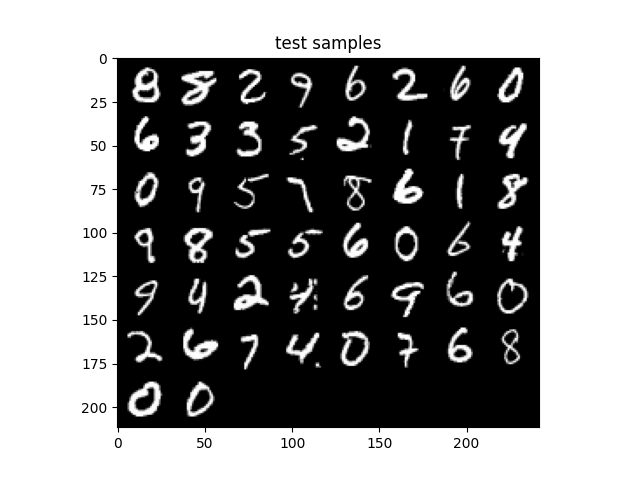 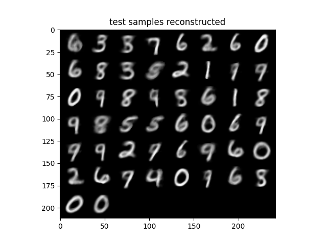

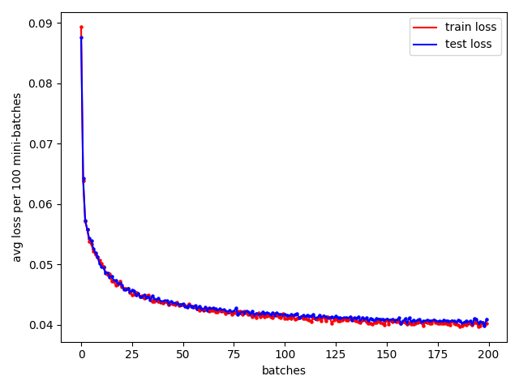

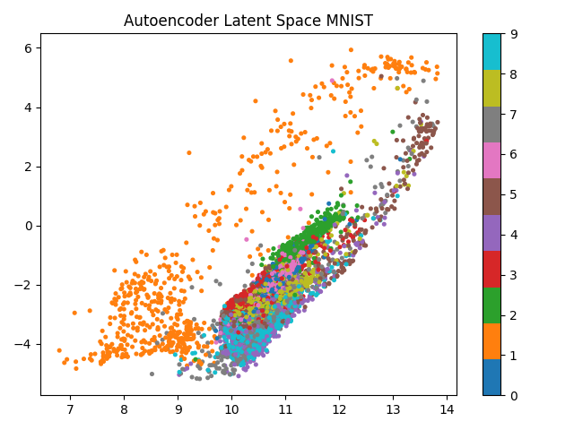

Convolutional Autoencoder:

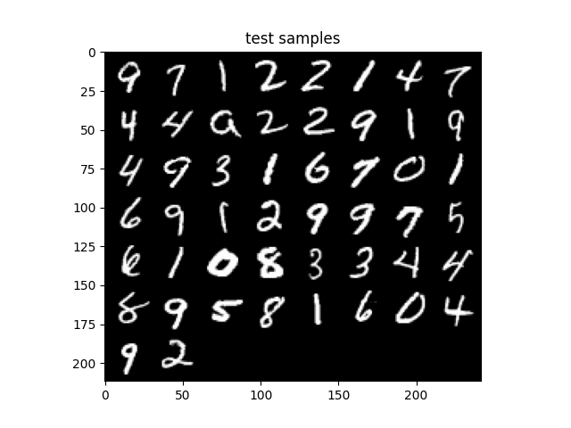

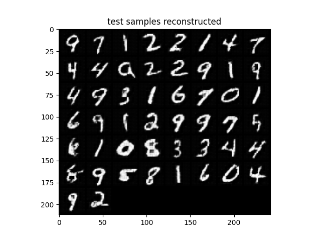

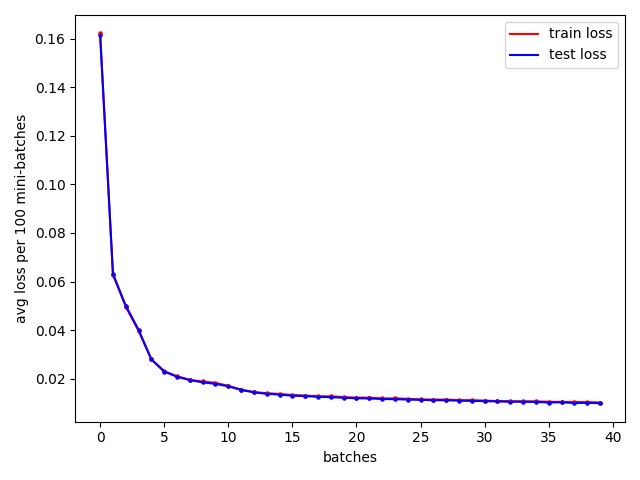

Varational Autoencoder:

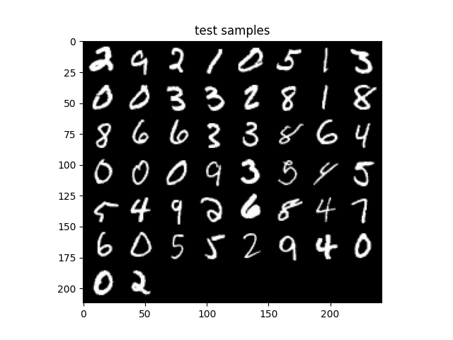

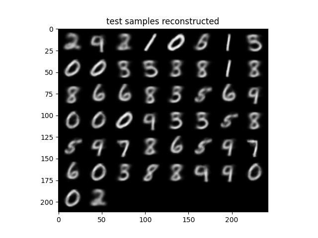

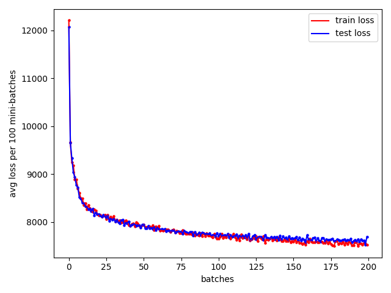

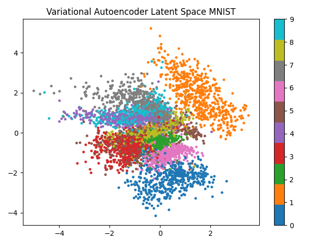

Convolutional Variational Autoencoder:

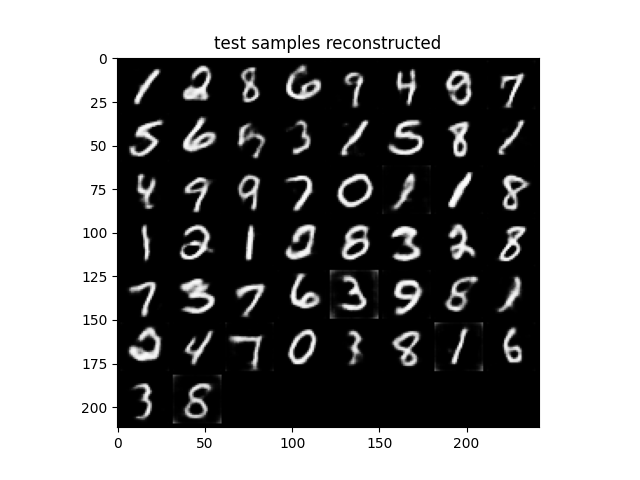
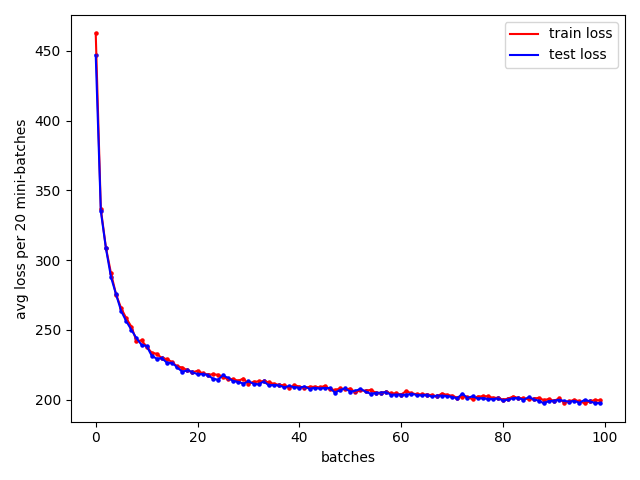

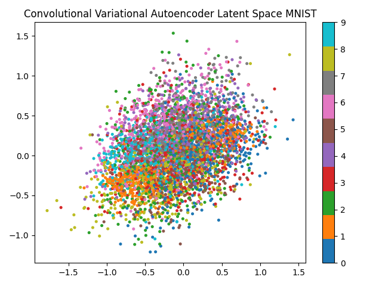

