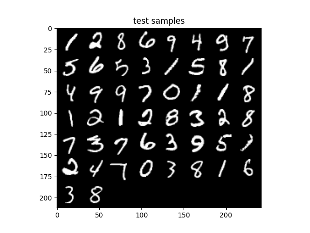

# autoencoders
Implementations of a autoencoder, convolutional autoencoder, variational autoencoder, and convolutional variational autoencoder using Pytorch to perform image reconstruction on MNIST.

Here we show figures for:
'''1. Original Input
2. Reconstructed Input
3. Train and Test loss curves
4. (if available) Latent Space

'''

Autoencoder:

 

Convolutional Autoencoder:

Varational Autoencoder:

Convolutional Variational Autoencoder:

